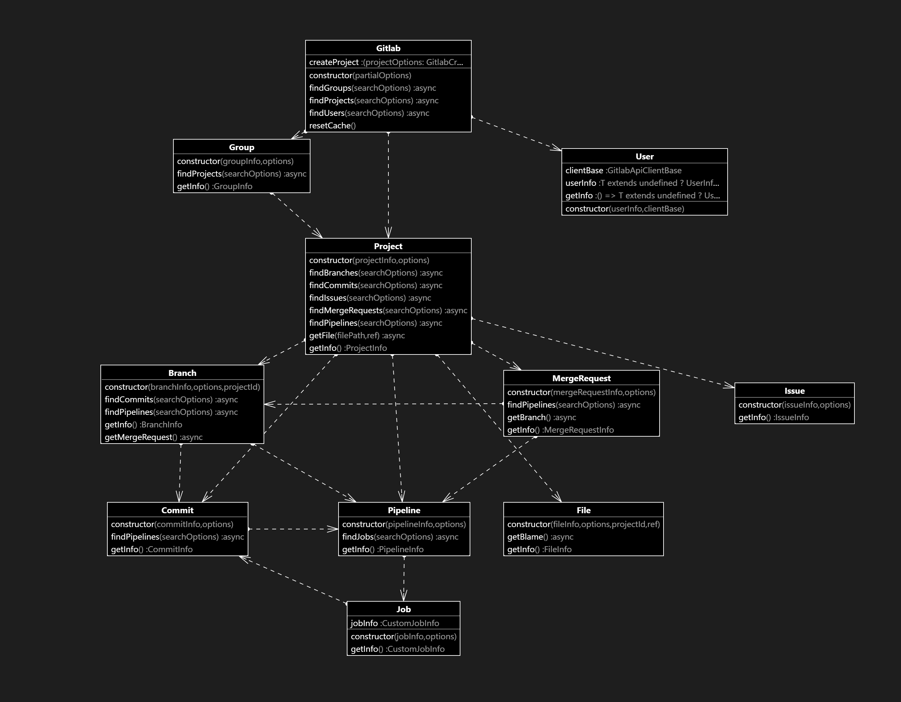

# Gitlab-client-api

[Gitlab-client-api](https://www.npmjs.com/package/gitlab-client-api) is a client api for the gitlab api (v4). It provides methods for all of the following:

- [x] Projects
- [x] Branches
- [x] Groups
- [x] Users
- [x] Issues
- [x] Merge Requests
- [x] Commits
- [x] Pipelines
- [x] Jobs
- [x] Files

## Installation

### npm

```bash
npm install gitlab-client-api
```

### yarn

```bash
yarn add gitlab-client-api
```

## Diagram



## Usage

```typescript
import { Gitlab } from "gitlab-client-api";

// Create a new instance of the gitlab client
// Either set the private token as options of provide env variable GITLAB_TOKEN
// Setting cache to true will cache the results of requests that were made with that instance of the client
// Cache can be disables within individual requests by setting cache to false

const gitlab = new Gitlab({
  privateToken: "your-private-token",
  gitlabUrl: "https://subdomain.gitlab.com", // default is https://gitlab.com
  cache: true, // default is false
});
```

### Cache

```typescript
// Cache can be cleared with
gitlab.resetCache();
```

### Users

```typescript
// find users
const users = await gitlab.findUsers({ search: "Hamza-bouhelal" });

// find user associated with the private token
const user = await gitlab.getUser();
```

### Groups

```typescript
// gets all groups matching the search term
const groups = await gitlab.findGroups({ search: "gitlab" });
```

### Projects

```typescript
// gets all projects matching the search term
const projects = await gitlab.findProjects({ search: "gitlab-client-api" });

// create new project
const newProject = await gitlab.createProject({ name: "test" });
```

### Issues

```typescript
const projects = await gitlab.findProjects();
const myProject = projects.find(
  (project) => project.getInfo().name === "myProject"
);
if (!myProject) return console.error("Project not found");

const issues = await myProject.findIssues();
```

### Files

```typescript
const projects = await gitlab.findProjects();
const myProject = projects.find(
  (project) => project.getInfo().name === "myProject"
);
if (!myProject) return console.error("Project not found");

const file = await myProject.getFile("/test.txt", "master");
```

### Merge Requests

```typescript
const projects = await gitlab.findProjects();
const myProject = projects.find(
  (project) => project.getInfo().name === "myProject"
);
if (!myProject) return console.error("Project not found");

const mergeRequests = await myProject.findMergeRequests();
```

### Branches

```typescript
// get all branches of a project
const projects = await gitlab.findProjects();
const myProject = projects.find(
  (project) => project.getInfo().name === "myProject"
);
if (!myProject) return console.error("Project not found");
const branches = await myProject.findBranches();
```

### Commits

```typescript
const projects = await gitlab.findProjects();
const myProject = projects.find(
  (project) => project.getInfo().name === "myProject"
);
if (!myProject) return console.error("Project not found");

const projectCommits = await myProject.findCommits();

const branches = await myProject.findBranches();
const masterBranch = branches.find(
  (branch) => branch.getInfo().name === "master"
);
if (!masterBranch) return console.error("Master branch not found");

const masterBranchCommits = await masterBranch.findCommits();
```

### Pipelines

```typescript
const projects = await gitlab.findProjects();
const myProject = projects.find(
  (project) => project.getInfo().name === "myProject"
);
if (!myProject) return console.error("Project not found");

// Find all pipelines for the project
const projectsPipelines = await myProject.findPipelines();

const mergeRequests = await myProject.findMergeRequests();
const mergeRequest = mergeRequests[0];
if (!mergeRequest) return console.error("Merge request not found");

// Find all pipelines for the merge request
const mergeRequestPipelines = await mergeRequest.findPipelines();

const branches = await myProject.findBranches();

const masterBranch = branches.find(
  (branch) => branch.getInfo().name === "master"
);
if (!masterBranch) return console.error("Master branch not found");

// Find all pipelines for the master branch
const masterBranchpipelines = await masterBranch.findPipelines();

const projectCommits = await myProject.findCommits();

// Find all pipelines for the first commit
const commitPipelines = await projectCommits[0].findPipelines();
```

### Jobs

```typescript
const jobs = await pipeline.findJobs();
```

## License

[MIT License](https://choosealicense.com/licenses/mit/)

Copyright (c) [2024] [Hamza Bouhelal]

Permission is hereby granted, free of charge, to any person obtaining a copy of this software and associated documentation files (the "Software"), to deal in the Software without restriction, including without limitation the rights to use, copy, modify, merge, publish, distribute, sublicense, and/or sell copies of the Software, and to permit persons to whom the Software is furnished to do so, subject to the following conditions:

The above copyright notice and this permission notice shall be included in all copies or substantial portions of the Software.

THE SOFTWARE IS PROVIDED "AS IS", WITHOUT WARRANTY OF ANY KIND, EXPRESS OR IMPLIED, INCLUDING BUT NOT LIMITED TO THE WARRANTIES OF MERCHANTABILITY, FITNESS FOR A PARTICULAR PURPOSE AND NONINFRINGEMENT. IN NO EVENT SHALL THE AUTHORS OR COPYRIGHT HOLDERS BE LIABLE FOR ANY CLAIM, DAMAGES OR OTHER LIABILITY, WHETHER IN AN ACTION OF CONTRACT, TORT OR OTHERWISE, ARISING FROM, OUT OF OR IN CONNECTION WITH THE SOFTWARE OR THE USE OR OTHER DEALINGS IN THE SOFTWARE.

## Contributing

Pull requests are welcome. For major changes, please open an issue first to discuss what you would like to change.
